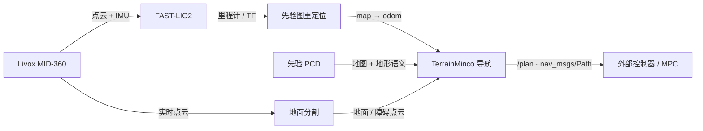

<div align="center">

# FASTLIO × NAV2

### 面向实车的激光建图、重定位与地形感知全局规划

**Livox MID-360 · FAST-LIO2 · Terrain-aware A* + MINCO · ROS 2 Humble**

[系统架构](#系统一览) · [快速开始](#快速开始) · [技术文档](#技术文档) · [配置入口](#配置入口)

</div>

---

把雷达看到的世界，变成机器人可以执行的路线。

本仓库是一套 ROS 2 实车导航工作区：从 MID-360 点云与 IMU 输入开始，完成激光里程计、先验地图重定位、地面与障碍分割，再生成避障且考虑坡道/台阶方向的全局路径。导航包负责输出路径，底盘控制由外部程序接入。

## 系统一览



| 能力 | 组件 | 输出重点 |
| --- | --- | --- |
| 雷达驱动 | `livox_ros_driver2` | MID-360 点云与 IMU |
| 里程计与重定位 | `fast_lio` | `/Odometry`、`/OdometryHighFreq`、TF、先验图对齐 |
| 地面与障碍分割 | `linefit_ground_segmentation_ros` | `/segmentation/ground`、`/segmentation/obstacle` |
| 地形感知全局规划 | `navigation` | `/map`、`/terrain/*` 输入，`/plan` 输出 |

## 快速开始

环境：Ubuntu + ROS 2 Humble，工作区默认位于 `~/workspace/fastlio_nav2`。

```bash
source /opt/ros/humble/setup.bash
cd ~/workspace/fastlio_nav2
rosdep install -r --from-paths src --ignore-src --rosdistro humble -y
colcon build --symlink-install --cmake-args -DCMAKE_BUILD_TYPE=Release
source install/setup.bash
```

先启动 Livox 驱动，再启动整条定位与导航链路：

```bash
ros2 launch livox_ros_driver2 msg_MID360_launch.py
MAP_PCD=/absolute/path/to/scans.pcd ./launch_gnome_chain.sh
```

重定位成功后，在导航 RViz 中使用 **Nav2 Goal** 设置终点；规划路径通过 `/plan` 发布。首次启动和实车操作细节见各包文档。

## 技术文档

| 包 | 文档内容 |
| --- | --- |
| [`fast_lio`](src/fast_lio/README.md) | 坐标系与外参、建图/重定位链路、高频里程计、配置与诊断 |
| [`navigation`](src/navigation/README.md) | 地形栅格、TerrainMinco 规划器、动态障碍、行为树、路径接口 |
| [`linefit_ground_segmentation_ros`](src/linefit_ground_segmentation_ros/README.md) | 分割节点、车体滤除、话题与参数说明 |
| [`linefit_ground_segmentation`](src/linefit_ground_segmentation/README.md) | LineFit 分割算法库与核心参数 |

## 配置入口

| 想调整 | 配置文件 |
| --- | --- |
| FAST-LIO 话题、雷达外参、滤波参数 | [`mid360.yaml`](src/fast_lio/config/mapping/mid360.yaml) |
| 重定位、PCD 地图及地形识别 | [`relocalization.yaml`](src/fast_lio/config/reloc/relocalization.yaml) |
| Nav2 costmap、规划器与实时性参数 | [`nav2_params.yaml`](src/navigation/params/nav2_params.yaml) |
| 地面分割、障碍高度和车体包围盒 | [`segmentation_params.yaml`](src/linefit_ground_segmentation_ros/launch/segmentation_params.yaml) |
| MID-360 IP 与设备网络参数 | [`MID360_config.json`](src/livox_ros_driver2/config/MID360_config.json) |

## 工作区布局

```text
src/
├── fast_lio/                         # 里程计、重定位与地图生成
├── livox_ros_driver2/                # MID-360 ROS 2 驱动
├── linefit_ground_segmentation/      # 地面分割核心算法库
├── linefit_ground_segmentation_ros/  # ROS 2 分割节点与参数
└── navigation/                       # Nav2 全局规划、TerrainMinco、RViz
```

> `navigation` 只负责全局路径规划，不发布底盘速度指令。外部控制器订阅 `/plan`，并结合适合控制闭环的速度反馈执行路径。
